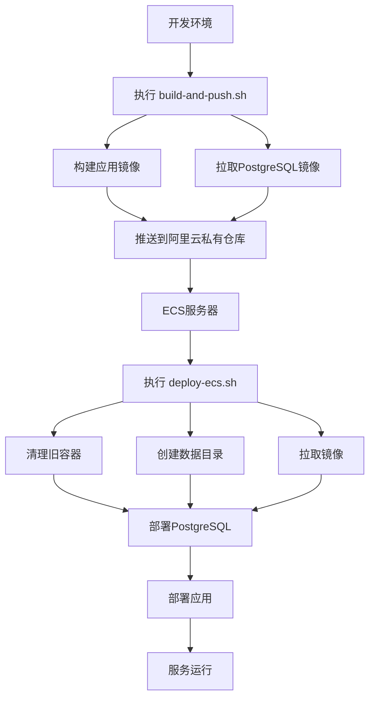

# 🚀 育婴宝项目部署工具

## 📁 文件说明

本目录包含育婴宝项目的核心部署工具，简化为2个主要脚本及其说明文档：

### 核心脚本

| 文件 | 功能 | 使用场景 |
|------|------|----------|
| [`build-and-push.sh`](./build-and-push.sh) | 本地构建和推送 | 开发环境，构建镜像并推送到阿里云 |
| [`deploy-ecs.sh`](./deploy-ecs.sh) | ECS部署 | 生产环境，在阿里云ECS上部署应用 |

### 说明文档

| 文件 | 内容 |
|------|------|
| [`BUILD_GUIDE.md`](./BUILD_GUIDE.md) | 构建脚本详细使用指南 |
| [`DEPLOY_GUIDE.md`](./DEPLOY_GUIDE.md) | ECS部署脚本详细使用指南 |

### 其他文件

| 文件 | 说明 |
|------|------|
| [`Dockerfile`](./Dockerfile) | Docker镜像构建文件 |

## 🚀 快速开始

### 1. 本地构建和推送

```bash
# 在开发环境执行
cd deploy2aliyun
./build-and-push.sh
```

详细说明请参考：[BUILD_GUIDE.md](./BUILD_GUIDE.md)

### 2. ECS部署

```bash
# 在阿里云ECS服务器执行
wget https://raw.githubusercontent.com/westxixia/yuyingbao/main/deploy2aliyun/deploy-ecs.sh
chmod +x deploy-ecs.sh
./deploy-ecs.sh
```

详细说明请参考：[DEPLOY_GUIDE.md](./DEPLOY_GUIDE.md)

## 🔄 完整部署流程



## 🗄️ 新增功能亮点

### 🧹 智能容器清理
- **全面检查**：自动检查并清理所有 `yuyingbao-server` 和 `yuyingbao-postgres` 容器
- **安全停止**：有序停止运行中的容器，再安全删除
- **状态反馈**：实时显示清理进度和结果

### 🗄️ 本地数据持久化
- **本地目录映射**：使用 `./postgres_data` 目录而不是 Docker 卷
- **数据安全**：即使删除容器，数据也不会丢失
- **可视化管理**：可直接查看、备份和迁移数据目录
- **权限管理**：自动设置正确的目录权限 (999:999)

### 🛠️ 增强管理命令
- `./deploy-ecs.sh status` - 显示数据目录大小和状态
- `./deploy-ecs.sh reset-data` - 彻底清理所有数据（危险操作）

## 🛠️ 技术栈

- **后端**: Spring Boot 3.3.2 + Java 17
- **数据库**: PostgreSQL 16
- **容器化**: Docker + Docker Compose
- **部署**: 阿里云ECS + 容器镜像服务

## 📋 系统要求

### 开发环境
- macOS 13.7+ / Linux
- Docker Desktop
- Java 17 + Maven
- 网络连接（用于推送镜像）

### 生产环境（ECS）
- 2CPU 2GB 内存（最低配置）
- CentOS 7+ / Ubuntu 18.04+
- 网络连接（用于拉取镜像）

## 🔧 故障排除

如遇到问题，请按以下顺序检查：

1. **网络连接**：确保能访问Docker Hub和阿里云镜像仓库
2. **权限问题**：确保当前用户有Docker权限
3. **资源不足**：检查磁盘空间和内存使用情况
4. **防火墙设置**：确保ECS安全组开放8080端口

详细的故障排除步骤请参考各自的使用指南。

## 📞 技术支持

如需帮助，请查看：
- [构建问题](./BUILD_GUIDE.md#🔧-故障排除)
- [部署问题](./DEPLOY_GUIDE.md#🔧-故障排除)
- [项目文档](../document/v0.5/)

---

© 2024 育婴宝项目 - 简化的部署解决方案